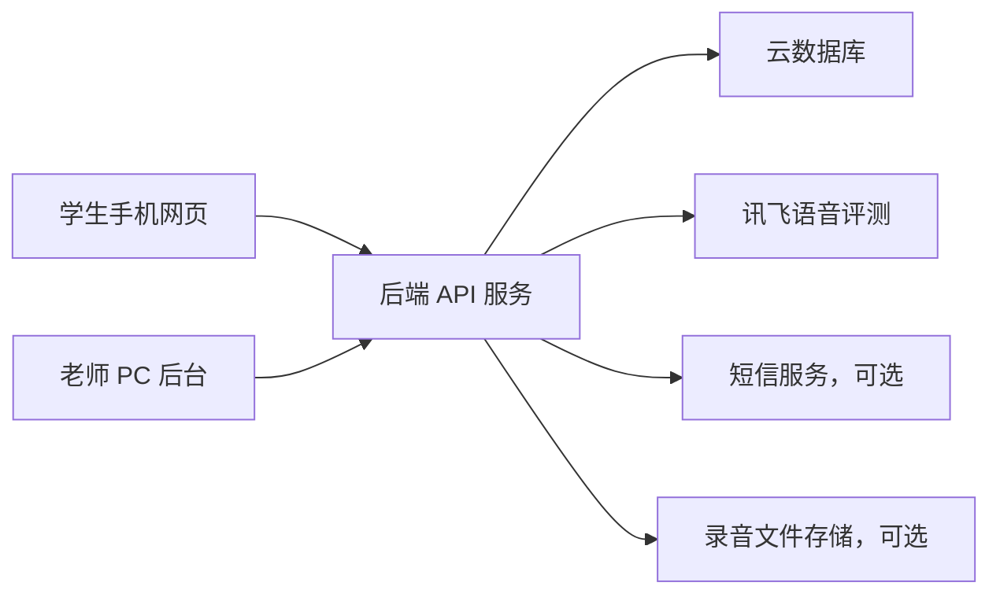

# 正式版系统设计

## 一、版本定位

当前项目已经完成本地试用版，核心能力包括：

- 学生端单词跟读、录音回放、讯飞正式评分。
- 学生身份信息：姓名、手机号、学号、班级。
- 系统自动点评和学习建议。
- 老师后台雏形：学生练习概览、班级均分、薄弱单词。
- 老师端本地导入单词和情景对话。

正式版目标不是马上做原生手机 App，而是先做“手机端网页 + PC 老师后台 + 云端数据”的学校试用版。

## 二、端的划分

### 学生端

建议形态：手机端网页/PWA。

学生通过浏览器访问一个正式 HTTPS 地址即可使用，后续可以添加到手机桌面，体验接近 App。

核心功能：

- 学生登录或填写身份信息。
- 查看老师布置的单元和单词。
- 播放标准发音。
- 录音跟读。
- 讯飞正式评分。
- 查看本次分数、系统点评和复习建议。
- 查看个人练习记录和错词。
- 进入情景对话练习。

第一阶段先不用短信登录，使用“手机号 + 姓名 + 班级”的简化身份识别。正式试用时再升级短信验证码。

### 老师端

建议形态：PC 网页后台，兼容手机查看。

老师端主要用于数据查看和内容管理，电脑使用更方便。

核心功能：

- 查看班级整体练习数据。
- 查看学生列表。
- 查看学生练习次数、平均分、最近练习时间。
- 查看薄弱单词统计。
- 查看单词评分明细和系统点评。
- 导出 Excel/CSV。
- 管理课程、单元和词表。
- 管理情景对话场景。

### 管理端

第一阶段可以和老师端合并，不单独做复杂管理端。

后续如果学校试用规模扩大，再拆分：

- 老师账号管理。
- 班级管理。
- 学生账号管理。
- 讯飞调用量统计。
- 系统配置。

## 三、正式版架构

## 四、核心业务流程

### 学生练习流程

1. 学生打开网页。
2. 输入或登录学生身份。
3. 选择课程单元。
4. 选择单词。
5. 听标准发音。
6. 录音跟读。
7. 后端调用讯飞评分。
8. 页面显示分数、细分指标和系统点评。
9. 后端保存练习记录。
10. 老师后台同步看到数据。

### 老师管理流程

1. 老师登录后台。
2. 创建课程或单元。
3. 导入单词、音标、释义、例句。
4. 导入或创建情景对话。
5. 查看学生练习情况。
6. 导出练习记录。
7. 根据薄弱单词安排课堂复习。

## 五、开发阶段建议

### 第 1 阶段：本地试用版

已经基本完成。

目标是验证功能是否符合老师和学生使用习惯。

### 第 2 阶段：云端试用版

目标是让武汉老师和学生可以统一访问。

重点：

- 部署后端服务。
- 接云数据库。
- 前端改为调用云端 API。
- 讯飞密钥放在服务器端。
- 老师后台读取真实学生数据。

### 第 3 阶段：登录和权限

重点：

- 学生手机号登录。
- 老师账号登录。
- 班级权限。
- 防止学生看到他人数据。

### 第 4 阶段：正式试点优化

重点：

- 导入 Excel 词表。
- 按单元布置任务。
- 学生完成率统计。
- 老师批量导出。
- 录音文件是否长期保存。

## 六、暂不建议优先做

- 原生手机 App。
- 复杂收费体系。
- 家长端。
- 排行榜。
- 过细的音素级可视化纠错。
- 大规模学校级组织架构。

这些功能会显著增加开发和维护成本，建议等老师试用反馈稳定后再考虑。

